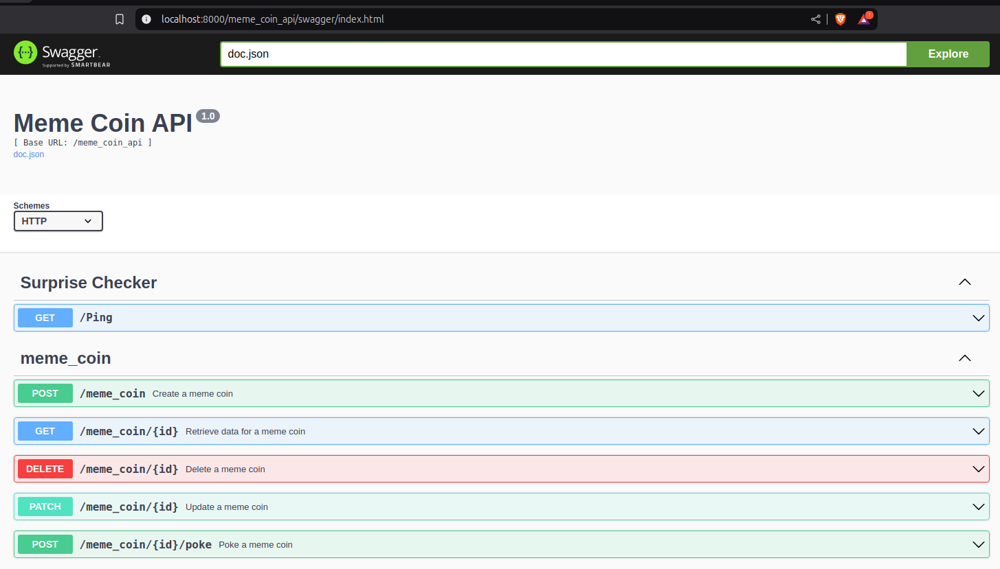

# Meme Coin API
Develop APIs for managing meme coins and containerize the application for
deployment.



## Project Structure
```
meme_coin_api/
├── assets/                             # Other assets to go along with the repository (images, logos, etc).
├── cmd/
|   ├── memeCoin/                       # Main applications for this project.
├── config/
│   │   ├── config.json                 # Configuration file for docker environment setup.
│   │   ├── local.json                  # Configuration file for local environment setup.
├── migrations/                         # SQL commands to be executed during docker-compose up.
├── service/
│   ├── api/                            # API route definitions
│   ├── controller/                     # Business logic
│   ├── internal/ 
│   │   ├── config/                     # Handles application configuration loading and management.
│   │   ├── database/                   # Establishes and manages database connections and queries.
│   │   ├── errorx/                     # Defines custom error handling logic and error types.
│   │   ├── flags/                      # Handles feature flags and application flags for toggling functionality.
│   │   ├── model/                      # Contains data models representing entities in the application.
│   │   ├── utils/                      # Provides utility functions and helpers for reusable logic.
│   ├── repository/                     # Abstracts data access, separating business logic from data source specifics.
│   │   ├── caches/
│   │   ├── orm/  
│   ├── memeCoin.go                     # Main service responsible for managing the project's dependency injection.
│   ├── service.go                      # Singleton interface ensuring the service is instantiated only once.
├── .gitignore
├── docker-compose.yml
├── Dockerfile                          
├── go.mod                            
├── go.sum                              
├── Makefile                            # Contains all the commands for managing this project
├── README.md                           # Project documentation
```

## Prerequisites
- Go: Version 1.20+
- Docker: Version 20.10+
- Docker Compose: Version 2.20+
- optional for local setup
    - MySQL
    - Redis
    - Swaggo

## Local Setup
1. Clone the repository and navigate to the project directory:
    ```
    git clone https://github.com/wwieo/meme_coin_api.git
    ```
2. To set up locally, install the `swaggo/swag` by following the instructions on
   the [website](https://github.com/swaggo/swag):
    ```
    go install github.com/swaggo/swag/cmd/swag@latest
    ```
3. Modify the [local configuration file](config/local.json) if necessary.
4. Ensure that both Redis and MySQL are running with your configuration settings.
5. This project does not support automatic database migration locally. Please create a database manually in MySQL.
    ```
    CREATE DATABASE IF NOT EXISTS meme_coin;
    ```
6. Start the application, and you should see the output below.
    ```
    make up
   
    # Output Like:
    2025/02/12 18:08:42 Pinged successfully mysql database: meme_coin
    2025/02/12 18:08:42 Pinged successfully redis: meme_coin
    Meme Coin API starts at :8000
    ```
7. Then you can open the local Swagger interface to explore the API.
    ```
    http://localhost:8000/meme_coin_api/swagger/index.html
    ```

## Running with Docker
1. Build
   ```
   make docker-build
   ```
2. Start
   ```
   make docker-up
   ```
3. Then you can open the local Swagger interface to explore the API.
   ```
   http://localhost:8000/meme_coin_api/swagger/index.html
   ```
